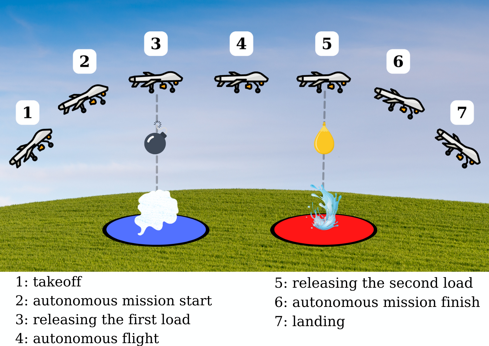

# anka-uav-tekno2022

Mission and flight software for the IEEE BTU ANKA fixed-wing UAV team (Teknofest International UAV Competition 2022). This repo contains the mission controller, perception helpers, detection experiments, visual assets, and design documentation used during the competition.



## Quick links
- Live page: https://yusufarbc.github.io/anka-uav-tekno2022/
- Project landing page (local): `index.html`
- Mission Planner (ArduPilot): https://ardupilot.org/planner/
- Competition report (PDF): `BTU_ANKA_Report_2022.pdf`

## Repository map
- `intuitive_shot_flight_algorithm/` - Mission controller, perception helpers, waypoint files, and runtime log.
- `algorithms/` - Standalone detection and image-processing experiments and demos.
- `assets/` - Team visuals (logo, mission views, flight photos) used across docs and the landing page.
- `index.html` - Project landing page showcasing the mission, team, and assets.
- `BTU_ANKA_Report_2022.pdf` - Teknofest 2022 team report.

## Getting started
Works with Python 3.8+; connect to either a simulator or hardware via a DroneKit-compatible connection string.

```powershell
python -m venv .venv
.\.venv\Scripts\Activate.ps1
pip install dronekit opencv-python numpy
cd intuitive_shot_flight_algorithm
python flight_controller.py --connect tcp:127.0.0.1:5762
```

Pre-flight notes:
- Tune `start_wp`, `stop_wp`, and throw timing values in `flight_controller.py` to match your Mission Planner file before flight.
- `perception.py` performs red-target detection; adjust HSV bounds if your marker color differs.
- Ground control: Mission Planner (ArduPilot) for uploading routes and monitoring telemetry.

## Core components
- `flight_controller.py` - DroneKit-based mission loop that reads waypoints, starts perception at a designated segment, computes lateral offset from the detected marker, rewrites waypoints in-air, and triggers payload release via RC channel overrides.
- `perception.py` - OpenCV helper that tracks a red target, captures the best frame, and logs bounding box data for offset computation.
- `flight_logger.py` - Lightweight logger used by the controller and perception modules.
- `mission_waypoints.txt` / `mission_waypoints_update.txt` - Example waypoint files for testing and logging updated routes.
- `runtime_log.txt` - Sample runtime output from a flight session.

## Detection experiments (`algorithms/`)
- `anka_detect/` - Team-specific detection utilities and a demo video.
- `detect_cpu/` - CPU-only detection experiments (Canny edge detector, legacy demos).
- `pixel_deviation/` - Pixel deviation experiment to estimate target offset versus frame center.

## Assets and reports
- Visuals: `assets/mission_diagram.png`, `assets/mission_planner_screenshot.png`, `assets/mission_view_01.png`, `assets/mission_view_02.png`, `assets/mission_view_03.png`, `assets/flight_test.png`, `assets/team_photo.jpg`, `assets/presentation_slides.png`, `assets/logo_team_anka.png`.
- Reports: `BTU_ANKA_Report_2022.pdf` (competition report).

---

# Preliminary Design Review (Teknofest 2022)

## Team and roles
- Team: IEEE BTU ANKA Fixed-Wing UAV Team.
- Role (author): Flight control plus mission/payload delivery software.
- Full roster and contacts: add an appendix with names and responsibilities.

## Mission problem statement
Fires can ignite along a conflict front line, threatening soldiers, vehicles, and civilians while making direct firefighting unsafe. The UAV mission aims to reduce risk and enable safe firefighting action.

## Proposed solution
Autonomous fixed-wing UAV mission that releases two payloads over predefined rectangular target zones to disrupt the threat and support firefighting:
- Payloads: two discrete loads (1x smoke, 1x water).
- Autonomy: route uploaded from the ground control station; automatic execution after a brief manual takeoff window.

## Mission area and target zones
- Flight area defined by the competition map and ground control station.
- Two rectangular release zones sized 10 m x 25 m placed along the mission route:
  - Blue zone: smoke release.
  - Red zone: water release.
- Visuals: mission route map with two 10 m x 25 m rectangles (blue and red).

## Pre-flight checklist
- Prepare UAV and payloads; verify fixtures, release servos, and center of gravity.
- Run airframe and avionics checks (control surfaces, servos, battery, telemetry link, ground station).
- Perform manual takeoff; after about five seconds of stable climb, switch to AUTO to start the autonomous mission.

## Autonomous flight sequence
1) Follow the pre-uploaded route from the ground control station (Mission Planner recommended).  
2) Release the smoke payload at the first target zone (blue).  
3) Release the water payload at the second target zone (red).  
4) After both payloads are released, the mission completes; return and land manually.

## UAV characteristics (design summary)
- Configuration: conventional mid-wing with conventional tail for stability and ease of production.
- Fuselage: 417 x 55 x 55 mm; plywood for low cost and simple fabrication.
- Wings: USA-35B airfoil; area 0.17 m^2; wingspan 1412 mm; mean chord 150 mm; tapered tips to reduce induced drag.
- Tail: conventional tail surfaces attached via carbon-fiber tube for stiffness and low weight.
- Landing gear: lightweight design using 3D-printed PLA components and steel wire to reduce fuselage damage on landing.

## Payload release mechanism
- Two servo-actuated release gates hold the payloads.
- Plywood structure for low mass and rigidity.
- Mechanism positioned to avoid center-of-gravity shift during release.
- Add drawings and mounting positions for completeness.

## Reports and data to gather
Collect engineering data to verify mission success:
- Mass breakdown, lift/drag calculations, propulsion and battery selection.
- Electrical power budget, servo/actuator specifications, structural materials and mass.
- Relevant software modules and test evidence.

### Payload location and system description
- Mid-wing and conventional tail configuration chosen for stability versus drag and cost.  
- Fuselage sized to house electronics within CG limits; plywood construction.  
- Wings optimized for stability and lift with USA-35B airfoil and tapered tips.  
- Landing gear: 3D-printed PLA plus steel wire for strength and light weight.  
- Release system: two servo motors triggered at GPS waypoints or upon entering the target rectangle.  
- Add a table with mechanical parts, materials, dimensions, quantities, and mass.

### UAV mass report
Provide mass entries for:
- Airframe (fuselage, wings, tail).
- Flight controller and avionics.
- Propulsion (motor, ESC, propeller).
- Battery (type, capacity, mass).
- Payloads (smoke and water simulants) and release mechanism.
- Landing gear and hardware.

### Flight time estimate with payload
- Formula: Airtime (t) = Distance (X) / Speed (V).
- Planned distance: about 400 m per lap; two laps -> about 800 m total.
- Cruise speed: 15 m/s (above estimated stall).
- Estimated autonomous flight time: ~800 / 15 ~ 53.3 s (reported as ~54 s).
- Add margin for manual takeoff/landing; planned total endurance target: ~75 s.
- Validate with complete mass and power budget plus flight testing.

### Electrical power budget
- Power (W) = Current (A) x Voltage (V).  
- Energy (J) = Flight time (s) x Power (W).
- Procedure:
  1. Collect current draw and voltage for each component (motor, ESC, servos, flight controller, telemetry, payload actuators).
  2. Sum component power to get cruise power.
  3. Multiply cruise power by planned flight time for required energy (convert to Wh/mAh for battery sizing).
- Add table: component, voltage (V), current (A), power (W), energy for planned time (J, Wh, mAh).

### Flight controller and software block diagram
Document block diagrams showing inputs, sensors, actuators, autopilot, mission manager, payload manager, telemetry, and safety/RTB behavior. Include:
- Sensor suite: IMU, GPS, barometer.
- Interfaces: radio/telemetry link, payload servo outputs.
- Ground control station link and mission upload path.

### Component selection
List and justify choices for motor, ESC, battery, servos, flight controller board, GPS module, telemetry radio, and structural materials. Include supplier part numbers, cost estimates, and any test results.


